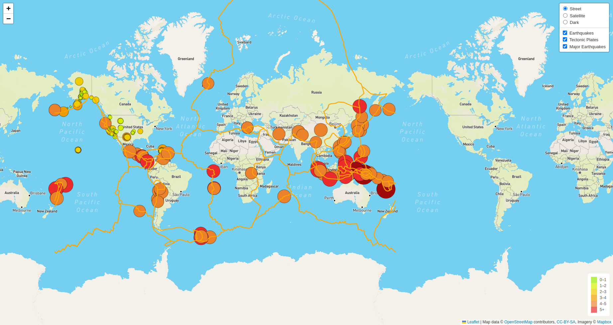

# Mapping_Earthquakes
Creating interactive maps using the Leaflet.js Application Programming Interface (API) to populate a geographical map with GeoJSON earthquake data from a URL.

## Background
### Overview
This project consists of three technical analysis deliverables.

- Deliverable 1: Add Tectonic Plate Data

- Deliverable 2: Add Major Earthquake Data

- Deliverable 3: Add an Additional Map

### Purpose

The purpose of this project is to visually show the differences between the magnitudes of earthquakes all over the world for the last seven days.
We created our earthquake map with two different maps and the earthquake overlay. Then we added the earthquake data in relation to the tectonic plates’ location on the earth, the earthquakes with a magnitude greater than 4.5, and we added the data on a third map.

## Methodology

- Used JavaScript and the D3.js library to retrieve the coordinates and magnitudes of the earthquakes from the GeoJSON data. 

- Used Leaflet library to plot the data on a Mapbox map through an API request and create interactivity for the earthquake data.

## Resources
 
Data source:
- (1) major_eq_starter_logic.js, (2) challenge_logic.js, (3) chart.js
 
Software:
- Visual Studio Code 1.68.1, HTML, CSS, Bootstrap and JavaScript
 
 

### Results

Using JavaScript, Leaflet, and D3, we re-factored the code of our index.html file to create an interactive earthquake map as shown in image (a).

 

(a)
 
 Figure (a) Earthquakes_maps

 

## Summary

- For this project we were able to create a dynamic dashboard that provided the client an effective way to filter the data for each bacterial sample, and provided 3 visualizations that changed accordenly with the sample selection. In order to let the client to try and feel the app we deployed the webpage using GitHub pages:

     - [link to deployed webpage](https://l-aldarondo.github.io/Biodiversity_with_Plotly/)

 

## References

[Markdown](https://docs.github.com/en/get-started/writing-on-github/getting-started-with-writing-and-formatting-on-github/basic-writing-and-formatting-syntax)
 
[Earthquake data](https://earthquake.usgs.gov/)
 
[Mapbox](https://docs.mapbox.com/api/maps/styles/)
